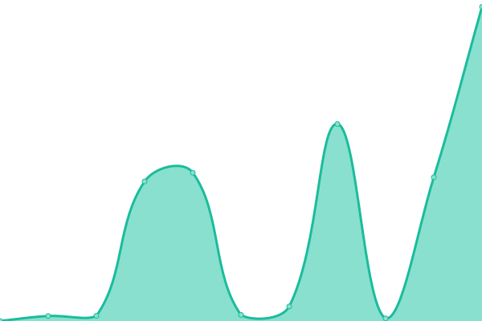

# [📈 Live Status](https://lexNwimue.github.io/filmhouse-monitor): <!--live status--> **🟩 All systems operational**

This repository contains the open-source uptime monitor and status page for [Filmhouse Cinemas](<[lexnwimue.github.io](https://www.filmhouseng.com/)>), powered by [Upptime](https://github.com/upptime/upptime).

With [Upptime](https://upptime.js.org), you can get your own unlimited and free uptime monitor and status page, powered entirely by a GitHub repository. We use [Issues](https://github.com/lexNwimue/filmhouse-monitor/issues) as incident reports, [Actions](https://github.com/lexNwimue/filmhouse-monitor/actions) as uptime monitors, and [Pages](https://lexNwimue.github.io/filmhouse-monitor) for the status page.

<!--start: status pages-->
<!-- This summary is generated by Upptime (https://github.com/upptime/upptime) -->
<!-- Do not edit this manually, your changes will be overwritten -->
<!-- prettier-ignore -->
| URL | Status | History | Response Time | Uptime |
| --- | ------ | ------- | ------------- | ------ |
|  [Filmhouse Frontend](https://www.filmhouseng.com) | 🟩 Up | [filmhouse-frontend.yml](https://github.com/lexNwimue/filmhouse-monitor/commits/HEAD/history/filmhouse-frontend.yml) | 

 992ms
     
 | 

<a href="https://lexNwimue.github.io/filmhouse-monitor/history/filmhouse-frontend">94.01%</a>
    

|  [Filmhouse Backend](https://fh-api.filmhouseng.com) | 🟩 Up | [filmhouse-backend.yml](https://github.com/lexNwimue/filmhouse-monitor/commits/HEAD/history/filmhouse-backend.yml) | 

 219ms
     
 | 

<a href="https://lexNwimue.github.io/filmhouse-monitor/history/filmhouse-backend">100.00%</a>
    

|  [Movie List](https://fh-api.filmhouseng.com/movie/new-list?cinema_id=12&start_date=2023-10-07&end_date=2023-10-07&platform=WEB) | 🟩 Up | [movie-list.yml](https://github.com/lexNwimue/filmhouse-monitor/commits/HEAD/history/movie-list.yml) | 

 2075ms
     
 | 

<a href="https://lexNwimue.github.io/filmhouse-monitor/history/movie-list">100.00%</a>
    

|  [Cinema List](https://fh-api.filmhouseng.com/cinema) | 🟩 Up | [cinema-list.yml](https://github.com/lexNwimue/filmhouse-monitor/commits/HEAD/history/cinema-list.yml) | 

 61ms
     
 | 

<a href="https://lexNwimue.github.io/filmhouse-monitor/history/cinema-list">100.00%</a>
    

|  [Movie Banners](https://fh-api.filmhouseng.com/movie/movie-banners?platform=WEB) | 🟩 Up | [movie-banners.yml](https://github.com/lexNwimue/filmhouse-monitor/commits/HEAD/history/movie-banners.yml) | 

 280ms
     
 | 

<a href="https://lexNwimue.github.io/filmhouse-monitor/history/movie-banners">100.00%</a>
    

|  [Coming Soon](https://fh-api.filmhouseng.com/movie/new-coming-soon?platform=WEB) | 🟩 Up | [coming-soon.yml](https://github.com/lexNwimue/filmhouse-monitor/commits/HEAD/history/coming-soon.yml) | 

 127ms
     
 | 

<a href="https://lexNwimue.github.io/filmhouse-monitor/history/coming-soon">100.00%</a>
    

<!--end: status pages-->

[**Visit our status website →**](https://lexNwimue.github.io/filmhouse-monitor)

## 📄 License

- Powered by: [Upptime](https://github.com/upptime/upptime)
- Code: [MIT](./LICENSE) © [Lex Nwimue P.](lexnwimue.github.io)
- Data in the `./history` directory: [Open Database License](https://opendatacommons.org/licenses/odbl/1-0/)
